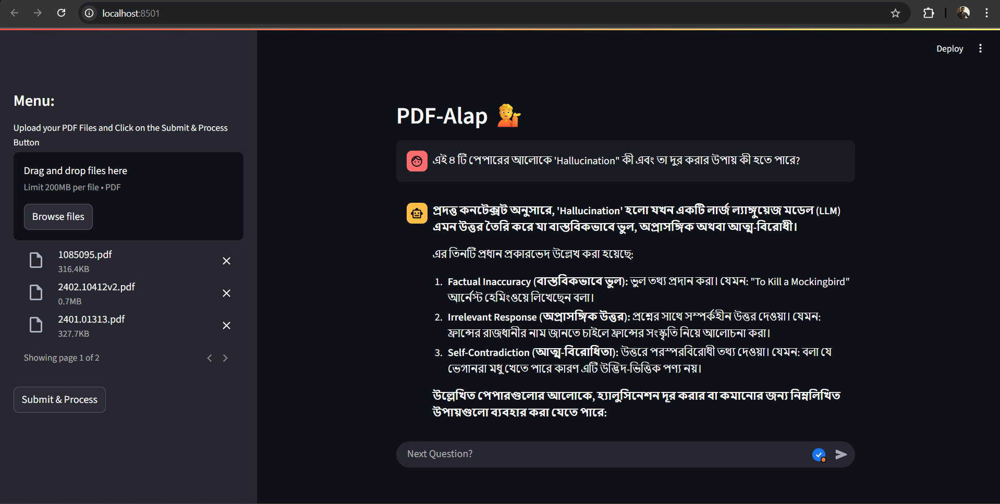

# **PDF-ALAP**  
## *Multilingual PDF & Image Chatbot (RAG System)*



[](https://www.python.org/)  
[](https://streamlit.io/)  
[](https://fastapi.tiangolo.com/)  
[](LICENSE)  
[](#)  

---

## 🎥 Demo
Here’s PDF-ALAP in action:  

  


---

## 📌 About the Project
**PDF-ALAP** is a **privacy-first, multilingual chatbot** that allows you to interact with **your own PDF and image documents**—in **Bangla** or **English**.  
Whether your files are text-based or scanned, PDF-ALAP extracts, searches, and answers your questions instantly.

This project was built to address a **real problem**:  
Finding and understanding information **locked inside PDFs and images**, **without uploading them to the cloud**.  

Perfect for:
- 📚 Students & Educators
- 📄 Researchers & Legal Professionals
- 🧾 HR & Corporate Teams
- 🔍 Anyone who values **data privacy**

---

## 🚀 Key Features

- 🌏 **Multilingual Support** – Ask questions in **Bangla** or **English**
- 📄 **Works with Any PDF or Image** – Supports scanned/image files with **OCR**
- 🔐 **Data Privacy First** – All processing stays **local**; no cloud upload
- 🧹 **Advanced Text Cleaning** – Removes noise & preserves structure (including MCQs)
- 🎯 **Semantic Search** – Accurate results powered by **FAISS** & embeddings
- 💬 **Conversational Memory** – Maintains context across multiple queries
- 🖥 **Modern UI** – Built with **Streamlit** for smooth, interactive chats
- ⚡ **REST API** – **FastAPI** backend for integration & automation
- 📊 **Evaluation Tools** – Check and measure answer quality
- 🔄 **Flexible Use Cases** – Education, resume comparison, legal document search, and more

---

## 🛠 How It Works

1. **Upload** one or more PDFs (text or scanned)
2. **Ask** questions in Bangla or English
3. **Receive** instant, document-grounded answers
4. **Enjoy privacy** – all processing stays on your device

---

## 📥 Getting Started

### 1️⃣ Install Dependencies
```sh
pip install -r requirements.txt


## How It Works

1. **Upload** one or more PDFs (text or scanned).
2. **Ask** questions in Bangla or English—about facts, MCQs, summaries, etc.
3. **Get Answers** instantly, grounded in your documents.
4. **All data stays on your device**—no cloud upload, no third-party sharing.

---

## Getting Started

### 1. Install Dependencies
```sh
pip install -r [requirements.txt](http://_vscodecontentref_/2)
```
### 2.Set Up Environment Variables
Create a .env file with your Google API key:
```
GOOGLE_API_KEY=your_google_api_key_here
```

### 
Install Tesseract OCR on your system.
Add the Tesseract executable path in your code before using pytesseract:
```
import pytesseract
pytesseract.pytesseract.tesseract_cmd = r'C:\Program Files\Tesseract-OCR\tesseract.exe'
```
### 4.Run the Streamlit App
```
streamlit run app.py
```
Use the sidebar to upload your PDF(s).
Chat with your documents in Bangla or English

### 5. Run the FAST API
```
uvicorn api:app --reload
```
Access the API docs at http://127.0.0.1:8000/docs
Use /upload_pdf/ to upload a PDF and /ask to ask questions.

## 🔐 Data Security & Privacy

- **Local Processing** – All parsing, embedding, and retrieval happen **on your machine**  
- **No Cloud Upload** – Files & queries are never sent to third parties  
- **Fully Open Source** – Review, modify, and deploy as you wish  

---

## 💡 Example Use Cases

- 📚 **Education** – Instantly answer questions from textbooks, notes, or exam papers  
- 🧾 **Resume Comparison** – Match candidate profiles with job descriptions  
- ⚖ **Legal Research** – Search & summarize lengthy legal documents  
- 📝 **MCQ Extraction** – Detect and retrieve multiple-choice questions from scanned or digital files  

---

## 🛣 Roadmap

- ✅ **MCQ/CQ Mode** – Specialized handling for question-based documents  
- ✅ **Paragraph & MCQ-aware Chunking** – Smarter text splitting for better context  
- ✅ **Advanced Document Comparison** – Side-by-side analysis across multiple PDFs  
- ☁ **Optional Cloud Deployment** – For team collaboration and remote use  
- 🌐 **More Languages** – Expanded multilingual embeddings and models  

---

## 🙌 Credits

- **Developer:** Chinmoy Mitra *(Designed, coded, and tested all core modules — OCR, chunking, vector search, LLM integration, UI, API, evaluation)*  
- **Special Thanks:** Open-source projects like **Streamlit**, **FastAPI**, **FAISS**, and **Tesseract**  

#Please give it a up if this project helped anyway. 🙏